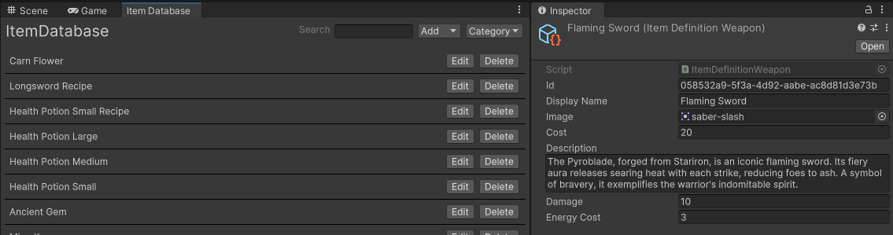
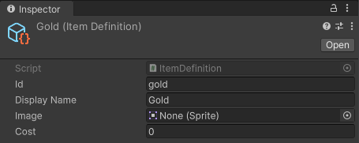
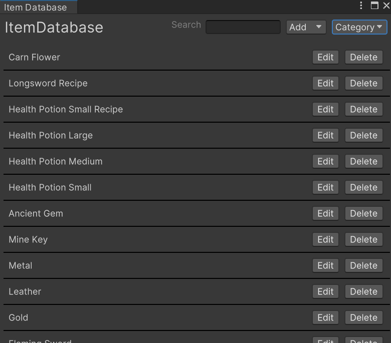
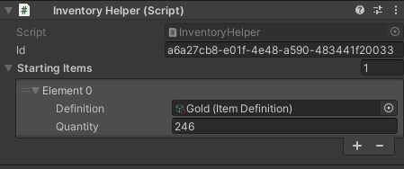
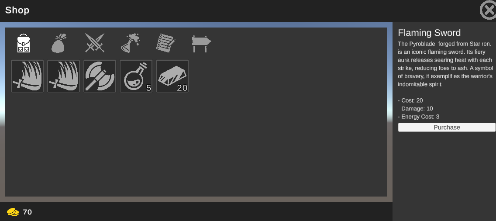

# Unity3d Inventory Framework - Elastic Inventory

An extendable Unity3D inventory library that leaves the implementation up to you. From simple inventory management to complex systems seen in Dark Souls, Diablo, Skyrim, ect. Stop rewriting your inventory and start building your game.



**Features**

* Instantly usable. Run the setup wizard, add an InventoryHelper, and you're done
* Built-in save/load support for customizable item properties (damage, durability, ect)
* Visual editor for managing item definitions
* Real-time inventory debugging
* Extendable item definitions (create weapons, tools, recipes, ect)
* Support for unique and stackable items
* Battle tested with automated tests
* Built for Unity (no integration overhead)

**Support**

Join the [Discord Community](https://discord.gg/8QHFfzn) if you have questions or need help.

## Sample Usage

Here is a practical `PlayerInventory` built with Elastic Inventory. You can shop, equip weapons, and use items. All with just a few lines of code.

```C#
using UnityEngine;
using CleverCrow.Fluid.ElasticInventory;

public class PlayerInventory : MonoBehaviour {
    public InventoryHelper inventory;
    public ItemEntryWeapon weapon;
    
    // Access your currency easily at any time
    public int Gold => inventory.Instance.Get("gold")?.Quantity ?? 0;
        
    // Ability to implement simple or complex purchasing logic
    public void BuyItem (ItemDefinition definition) {
        if (Gold < definition.cost) return;
        
        // Perform inventory CRUD with IDs or definitions
        inventory.Instance.Add(definition);
        inventory.Instance.Remove("gold", definition.cost);
    }
        
    public void EquipWeapon (string weaponEntryId) {
        // Use a custom weapon entry here to add properties like damage, durability, etc.
        weapon = inventory.Instance.GetEntry(weaponEntryId) as ItemEntryWeapon;
    }
    
    public void UseItem (ItemDefinition definition) {
        inventory.Instance.Remove(definition);
        
        // Use() is a custom method we've added. Heal a player, trigger an ability, whatever you want
        definition.Use();
    }
}
```

The above example assumes that you've created custom definitions and logic for your inventory. As Elastic Inventory's implementation is completely up to you, it serves as a bare-bones framework. Let's set up the ability to create items and make your first inventory in the [Getting Started Guide](#getting-started-guide).

## Table of Contents

- [Getting Started Guide](#getting-started-guide)
    * [Important Architecture Concepts](#important-architecture-concepts)
    * [Example Store](#example-store)
- [Documentation](#documentation)
    * [Inventory Instance](#inventory-instance)
        + [Add item(s)](#add-items)
        + [Remove item(s)](#remove-items)
        + [Get item(s)](#get-items)
        + [Get All Items](#get-all-items)
        + [Has items](#has-items)
        + [Events](#events)
        + [Sorting items](#sorting-items)
        + [Saving and Loading](#saving-and-loading)
        + [Custom Implementation](#custom-implementation)
    * [Inventory Helper](#inventory-helper)
        + [Save and Load](#save-and-load)
    * [Item Database](#item-database-1)
        + [Get an item definition](#get-an-item-definition)
        + [Save and Load](#save-and-load-1)
        + [Manual saving and loading](#manual-saving-and-loading)
        + [Globally Access The Item Database](#globally-access-the-item-database)
        + [Syncing Missing Items](#syncing-missing-items)
        + [Repairing IDs](#repairing-ids)
            - [Modifying IDs in Production](#modifying-ids-in-production)
- [Recipes](#recipes)
    * [Custom Item Definitions](#custom-item-definitions)
        + [Custom Item Entries](#custom-item-entries)
    * [Creating Unique Items](#creating-unique-items)
    * [Saving and Loading](#saving-and-loading-1)
    * [Swapping items between inventories](#swapping-items-between-inventories)
        + [Moving custom entries with stackable items](#moving-custom-entries-with-stackable-items)
- [Developers Guide](#developers-guide)

## Getting Started Guide

Elastic Inventory is used through [Unity's Package Manager](https://docs.unity3d.com/Manual/CustomPackages.html). In order to use it you'll need to add the following lines to your `Packages/manifest.json` file. After that you'll be able to visually control what specific version of Elastic Inventory you're using from the package manager window in Unity. This has to be done so your Unity editor can connect to NPM's package registry.

```json
{
  "scopedRegistries": [
    {
      "name": "NPM",
      "url": "https://registry.npmjs.org",
      "scopes": [
        "com.fluid"
      ]
    }
  ],
  "dependencies": {
    "com.fluid.elastic-inventory": "1.0.1"
  }
}
```

Next you'll be greeted with a configuration wizard. Run it and you'll be able to create items by selecting the `ElasticInventory/Resources/ItemDatabase` asset and clicking the edit button. 

Before you create an item, we recommend customizing the automatically generated item definition at `ElasticInventory/ItemDefinition` to your needs. This will allow you to add your own custom fields to items. Add a `cost` field to the auto generated definition.

```C#
public class ItemDefinition : ItemDefinitionBase {
    public int cost;
}
```

Now all items will have a cost field you can use to buy and sell items.

Add a gold item to the `ItemDatabase` by clicking "Add". This will be used to purchase items. Make sure you set the definition `id` to `"gold"` in the inspector (defaults to a randomly generated unique ID). I added an extra image field, you wont need to do that.



Also add a few quick items to buy such as a Mine Key and Longsword with a specified cost. We'll use these to purchase items for a player inventory. Here is an example of what that might look like if you added a lot of items.



Now add an `InventoryHelper` to a GameObject in a scene. This will automatically handle generating and maintaining an inventory for you. Add the gold to the starting items. Make sure you have enough gold to buy the items you want.



Last but not least, we need a script that facilitates item purchases. Let's create a script that automatically buys an item on `Start` with the logic we just wrote.

```C#
using UnityEngine;
using CleverCrow.Fluid.ElasticInventory;
using System.Collections.Generic;

public class PlayerInventory : MonoBehaviour {
    public InventoryHelper inventory;
    public List<ItemDefinition> itemsToBuy;
    
    void Start () {
        foreach (var item in itemsToBuy) {
            inventory.Instance.Remove("gold", item.cost);
            inventory.Instance.Add(item);
        }
    }
}
```

Add the script, then attach the InventoryHelper to it and run the game. Notice that the item list on the InventoryHelper automatically updates its contents when run. This live debugging tool allows you to see what's in your inventory at any time.


Some of your names might differ from the above image. But when you run your UI, it should resemble this image.

Congratulations! You now have a fully functioning inventory. Refer to the guides and docs below for advanced usage.

### Important Architecture Concepts

Before you delve deeper, we recommend reading the following core concepts. These are the architectural patterns/concepts that drive Elastic Inventory.

#### Item Database 

The item database is a collection of item definitions. It's a scriptable object that can be edited in the Unity inspector. It's used to create and edit item definitions. At runtime a copy is lazy loaded for use by your inventory scripts.

#### Item Entry

An item entry is a reference to a living item in your inventory. It contains a reference to the item definition, timestamps, quantities, and other runtime specific data. It also contains a unique ID that can be used to reference the item in the inventory. Any data edited here will be automatically saved and loaded by the item entry data resolver. 

#### Item Definition

An item definition is a template for an item. They form the backbone of the item entries' implementation. It contains a unique ID, a name, and any custom properties you've added to the definition. Note that definitions are static - they should never be edited at runtime. If you need to edit an item at runtime, use an item entry. Definitions can be stackable (default behavior) or unique (only one per stack).

### Example Store

We strongly recommend running the example store in the Assets/Examples/Shop folder. It's a fully functional store with a player and shop inventory. It demonstrates saving, loading, buying items, custom properties, and more, all with an easy-to-use interface.

[](https://github.com/ashblue/unity-elastic-inventory/tree/develop/Assets/Examples/Shop)

To run it download/clone this repo and run the corresponding scene.

## Documentation

### Inventory Instance

The inventory instance is a non-implementation specific representation of an inventory. It's a simple class that contains a list of items and a few helper methods. It's also serializable so it can be saved and loaded.

#### Add item(s)

There are multiple ways to add an item. By definition, definition ID, or entry. Note that all `Add` methods return an `IItemEntryReadOnly` interface that can be used to reference the item in the inventory. See the corresponding interface for more information.
    
```C#
// Add by definition reference
var entry = inventory.Instance.Add(definition, 2);
Debug.Log(entry.Id); // Unique ID of the entry

// Add by definition ID. Note you must have a definition with the ID "sword" in your database
inventory.Instance.Add("sword", 1);

// Entry should be a reference to an existing entry. The reference will be added to the inventory.
// Primarily used for moving items between inventories and unique items
// Make sure the entry is removed from the original inventory before calling this
oldInventory.Instance.RemoveEntry(entry.Id);
inventory.Instance.AddEntry(entry);
```

#### Remove item(s)

There are multiple ways to remove an item. By definition, definition ID, or entry. 

Please note that unique items can only be removed by calling `RemoveEntry(ID)`. This is because a unique ID is required to remove an item when there are potentially multiple entries.

```C#
// Remove by definition reference
inventory.Instance.Remove(definition, 1);

// Remove by definition ID. Note you must have a definition with the ID "gold" in your database. 
inventory.Instance.Remove("gold", 202);

// Remove by entry ID reference. Note that every entry has a unique ID
inventory.Instance.RemoveEntry("my-entry-id");
```

#### Get item(s)

There are multiple ways to get an item entry. By definition, definition ID, or entry. If an item doesn't exist you will receive a `null` value.

```C#
// Get by definition reference
inventory.Instance.Get(definition);

// Get by definition ID. Note you must have a definition with the ID "gold" in your database.
inventory.Instance.Get("gold");

// Get by entry reference
inventory.Instance.GetEntry("my-entry-id");
```

#### Get All Items

You can retrieve all items in an inventory. You can also specify an optional `definitionType` and/or `category` to filter the results.

```C#
// Get all items
inventory.Instance.GetAll();

// Get all items of a specific definition type
var type = typeof(GearDefinition);
inventory.Instance.GetAll(definitionType: type);

// Get all items of a specific category
inventory.Instance.GetAll(category: "weapon");

// Get all items of a specific definition type and category
inventory.Instance.GetAll(definitionType: type, category: "weapon");
```

#### Has items

You can easily check if an item exists by using a definition, definition ID, or entry ID.

```C#
// Check by definition reference
inventory.Instance.Has(definition, 1);

// Check by definition ID. Note you must have a definition with the ID "gold" in your database.
inventory.Instance.Has("gold", 202);

// Check by entry reference ID
inventory.Instance.HasEntry("my-entry-id");
```

#### Events

Several events will automatically fire whenever an inventory is edited. This is extremely useful for UI updates and quests that require you to gather items. You can subscribe to these events with the following snippets.

```C#
// Subscribe to item added event
inventory.Instance.ItemAdded.AddListener((item) => {
    Debug.Log("Item added: " + item.Definition.DisplayName);
});

// Subscribe to item removed event
inventory.Instance.ItemRemoved.AddListener((item) => {
    Debug.Log("Item removed: " + item.Definition.DisplayName);
});

// Subscribe to item quantity changed event
// Note this will fire when an item is added or removed
inventory.Instance.ItemChanged.AddListener((item) => {
    Debug.Log("Item quantity changed: " + item.Definition.DisplayName);
});
```

As with all event subscriptions, it is recommended to unsubscribe when the object is destroyed. The easiest way to do this is subscribe to the event with a method reference. Then you can unsubscribe with the same method reference when you're done.

```C#
inventory.Instance.ItemAdded.RemoveListener(methodReferenceHere);
```

#### Sorting items

You can sort a list from GetAll in place by calling Sort on it. Sorting options include primary sort, secondary sort, order, and secondary order.

```C#
var items = inventory.Instance.GetAll();

// Sort by category, then alphabetical
inventory.Instance.Sort(
    items: items, 
    sort: ItemSort.Category,
    sortSecondary: ItemSort.Alphabetical,
    orderSecondary: SortOrder.Ascending,
);
```

You can also sort by a custom category order. This is useful if you want to sort multiple forms of gear or items in a specific order.

```C#
var items = inventory.Instance.GetAll();

var customCategorySort = new List<CategorySort> {
    new("Weapons", 0),
    new("Armor", 1),
    new("Consumables", 2),
    new("Story", 3),
};

inventory.Instance.Sort(
    items: items, 
    sort: ItemSort.Category,
    customCategory: customCategorySort,
);
```


#### Saving and Loading

You can save and load an inventory instance with the following snippets. This should only be done if you wish to create your own implementation of `InventoryInstance` without using the `InventoryHelper`. It's recommended you use the `InventoryHelper` class to save and load inventories for simplicity.

```C#
// Save an inventory instance
var save = inventory.Instance.Save();

// Load an inventory instance
var inventoryInstance = new InventoryInstance(ItemDatabase.Current);
inventoryInstance.Load(save);
```

#### Custom Implementation

You can create your own inventory instances with a custom implementation separate from an Inventory Helper. This will give you full granular control. See the `InventoryInstance` class and test file for more information.

### Inventory Helper

The InventoryHelper is a light wrapper that automatically manages a simple implementation of an inventory instance for you with a lazy loaded [database](https://github.com/ashblue/fluid-database). It's designed to only include the minimal logic required to get an inventory up and running. If you need more control, re-implement this instead of overriding it.

#### Save and Load

When calling `Save()` the inventory helper will automatically write data to a `GlobalDatabaseManager` singleton for you. It uses the ID in the inspector to generate a unique key.

```C#
inventoryHelper.Save();
```

There is no `Load` method as the inventory helper will automatically load the inventory from the database every time it's initialized.

### Item Database

The item database is a container for all item definitions. When initially called at runtime a copy is created and stored in memory. That said you should not try to edit your item definition database at runtime.

#### Get an item definition

You can get an item definition by ID. If an item definition doesn't exist you will receive a `null` value.

```C#
var itemDefinition = ItemDatabase.Current.Get("gold");
```

#### Save and Load

To save the database you only need to call `Save()`. This will write the database to a `GlobalDatabaseManager` singleton. Doing this is strongly recommended as the database keeps track of the total inventory item count in your project. The item count is used for specific kinds of sorting. If you notice issues with create at and updated at timestamps when sorting, it's likely because you haven't saved your database.

```C#  
ItemDatabase.Current.Save();
```

If `_autoLoad` is checked you won't need to manage loading your database. As it will automatically pull from the `GlobalDatabaseManager` singleton. If you want to manually load your database you can do so with the following snippet.

```C#
ItemDatabase.Current.Load();
```

#### Manual saving and loading

If you want to manage the save and load of your database by hand, there is a manual save and load method you can use.
    
```C#
var save = ItemDatabase.Current.SaveManual();
ItemDatabase.Current.LoadManual(save);
```

#### Globally Access The Item Database

You can access the item database from anywhere in your code with the following snippet. It'll create a runtime instance if one doesn't already exist.

```C#
var itemDatabase = ItemDatabase.Current;
```

#### Syncing Missing Items

If your item definitions get out of sync. You can repair them by clicking the "Sync" button on the database. This will clear all your definition references and rebuild them from the Unity's Asset Database. Useful if you're manually editing item definitions in the project window.

#### Repairing IDs

Duplicate item definition IDs can cause issues in your project. Therefore, it is strongly recommended to repair the IDs if you clone or copy an item definition.

Elastic Inventory comes with a button on the database object called "Repair IDs." It will automatically repair all duplicate IDs and print the details to the logs. We suggest reviewing the logs. As you may need to adjust what IDs have been repaired to ensure save and load data doesn't get corrupted for items already in production.

##### Modifying IDs in Production

Keep in mind item definition IDs are used to save and load your inventory. If you change IDs that existing saves are using, you will need to write your own migration code. Elastic inventory does not come with a tool to fix this. It's recommended to NEVER change item definition IDs that users are saving and loading in production.

## Recipes

The following examples demonstrate solutions to common tasks or situations you may encounter.

### Custom Item Definitions

To add unique serialized fields to your items, such as a weapon with damage and energy cost, you can create custom item definitions. Here's a code snippet to illustrate this:

```C#
using CleverCrow.Fluid.ElasticInventory;
using UnityEngine;

// This attribute is required to register the item definition with the database and to give it a dropdown name
[ItemDefinitionDetails("Weapon")]
public class ItemDefinitionWeapon : ItemDefinitionBase {
    [SerializeField]
    private int _damage;

    [SerializeField]
    private int _energyCost;

    // Add this category to the database's category list for filterability in the database editor
    public override string Category => "Weapon";
    
    public override bool Unique => true;
    public int Damage => _damage;
    public int EnergyCost => _energyCost;
}
```

#### Custom Item Entries

To create a custom item entry, extend the ItemEntryBase class. This allows you to add custom fields to the item entry. For instance, to add a level and durability field, refer to the following snippet:

```C#
using CleverCrow.Fluid.ElasticInventory;

public class ItemEntryWeapon : ItemEntryBase {
    public int Level { get; set; } = 1;
    public int Durability { get; set; } = 1000;
}
```

To save and load the new entry fields above, create an ItemEntryDataResolver, a class that handles serialization and deserialization. This class will manage saving and loading your custom entry fields:

```C#
using CleverCrow.Fluid.ElasticInventory;

[System.Serializable]
public class ItemEntryDataResolverWeapon : ItemEntryDataResolverBase<ItemEntryWeapon> {
    public int level;
    public int durability;

    protected override void OnSave (ItemEntryWeapon itemEntry) {
        level = itemEntry.Level;
        durability = itemEntry.Durability;
    }

    protected override void OnLoad (ItemEntryWeapon itemEntry) {
        itemEntry.Level = level;
        itemEntry.Durability = durability;
    }

    // Data resolvers are reused by each definition. It's recommended to reset data here to avoid data leakage between saving and loading items
    protected override void OnReset () {
        level = 0;
        durability = 0;
    }
}
```

Lastly, inform your custom ItemDefinition about the new entry and data resolver. This can be achieved by adding the following logic:

```C#
public class ItemDefinitionWeapon : ItemDefinitionBase {
    public override IItemEntryDataResolver DataResolver => new ItemEntryDataResolverWeapon();
    
    public override IItemEntry CreateItemEntry (IItemDatabase database, int quantity = 1, string id = null, int? createdAt = null, int? updatedAt = null) {
        // We have to initialize a new implementation of the entry here
        // This is because the database doesn't know about our custom entry type
        var entry = new ItemEntryWeapon();
        entry.Setup(database, this, quantity, id, createdAt, updatedAt);

        return entry;
    }
}
```

### Creating Unique Items

By default, items are stackable (adding multiple entries will increase the quantity). However, if you want to create a unique item that generates new entry every time it's added, override the `Unique` property on the item definition. This can be useful for gear, abilities, tools, or other items that should not stack:

```C#
using CleverCrow.Fluid.ElasticInventory;

public class MyUniqueItem : ItemDefinitionBase {
    public override bool Unique => true;
}
```

### Saving and Loading

Saving and loading is handled automatically by the `GlobalDatabaseManager` singleton (unless manually implemented, which is not recommended). Nonetheless, you still need to restore the `GlobalDatabaseManager` save data. Here's a class that quickly enables saving and loading. Note, there are various ways to achieve this, and you may need to adjust the following code to suit your project:

```C#
using System.Collections.Generic;
using CleverCrow.Fluid.Databases;
using CleverCrow.Fluid.ElasticInventory;
using UnityEngine;

/// <summary>
/// Please note this script must execute before the inventory helper and item database scripts
/// You'll need to manually set the index in the script execution order window
/// https://docs.unity3d.com/Manual/class-MonoManager.html
/// </summary>
public class InventorySaveHelper : MonoBehaviour {
    const string SAVE_KEY = "GLOBAL_DATABASE_SAVE";
    
    // Attach all your game's inventories here
    [SerializeField]
    List<InventoryHelper> _inventories;

    void Awake () {
        if (!PlayerPrefs.HasKey(SAVE_KEY)) return;

        // Restore the inventory database
        var save = PlayerPrefs.GetString(SAVE_KEY);
        GlobalDatabaseManager.Instance.Load(save);
    }

    // Call this method to save all inventory data
    public void Save () {
        _inventories.ForEach(i => i.Save());
        ItemDatabase.Current.Save();

        var save = GlobalDatabaseManager.Instance.Save();
        
        // We're using PlayerPrefs to quickly save the data, but you can use whatever you want here
        PlayerPrefs.SetString(SAVE_KEY, save);
    }
}
```

### Swapping items between inventories

Item transfer between inventories is a frequent task. For instance, you may want to move an item from a player's inventory to a chest. The following snippet demonstrates how to do this:

```C#
public void TransferItem (IItemEntryReadOnly item, int quantity, IInventoryInstance from, IInventoryInstance to) {
    from.RemoveEntry(item.Id, quantity);
    to.AddEntry(item);
}

inventory.TransferItem(entry, 1, playerInventory, chestInventory);
```

In this example we're using the `RemoveEntry` and `AddEntry` methods to move the item. This approach is recommended when dealing with entries, as it prevents the loss of custom entry data (like durability and level) on unique items.

#### Moving custom entries with stackable items

Note that stackable items will not transfer custom entry data. This is by design, as the `Add` methods only modify the existing quantity of a stack. If you want to transfer custom entry data on stacks, you must manually handle it.

Not transferring stackable item entry data is by design. For instance, consider a healing flask with a quantity of 10 and a custom entry level of 2 to increase the healing amount. In this case, the player is buying/selling charges, not flasks. The flask bottle serves as a container. Therefore, when the player purchases 5 charges from a store, the default custom entry level of 1 in the store should not be transferred.

## Developers Guide

How to run the development environment and access various development tools.

### Releases

Archives of specific versions and release notes are available on the [releases page](https://github.com/ashblue/unity-elastic-inventory/releases).

### Nightly Builds

To access nightly builds of the `develop` branch that are package manager friendly, you'll need to manually edit your `Packages/manifest.json` as so. 

```json
{
    "dependencies": {
      "com.fluid.elastic-inventory": "https://github.com/ashblue/unity-elastic-inventory.git#nightly"
    }
}
```

Note that to get a newer nightly build you must delete this line and any related lock data in the manifest, let Unity rebuild, then add it back. As Unity locks the commit hash for Git urls as packages.

### Development Environment

If you wish to run the development environment you'll need to install the [Node.js](https://nodejs.org/en/) version in the [.nvmrc](.nvmrc) file. The easiest way to do this is install [NVM](https://github.com/nvm-sh/nvm) and run `nvm use`. 

Once you've installed Node.js, run the following from the root once.

`npm install`

If you wish to create a build run `npm run build` from the root and it will populate the `dist` folder.

#### Making Commits

All commits should be made using [Commitizen](https://github.com/commitizen/cz-cli) (which is automatically installed when running `npm install`). Commits are automatically compiled to version numbers on release so this is very important. PRs that don't have Commitizen based commits will be rejected.

To make a commit type the following into a terminal from the root.

```bash
npm run commit
```

### How To Contribute

Please see the [CONTRIBUTIONS.md](CONTRIBUTING.md) file for full details on how to contribute to this project.

---

This project was generated with [Oyster Package Generator](https://github.com/ashblue/oyster-package-generator).
